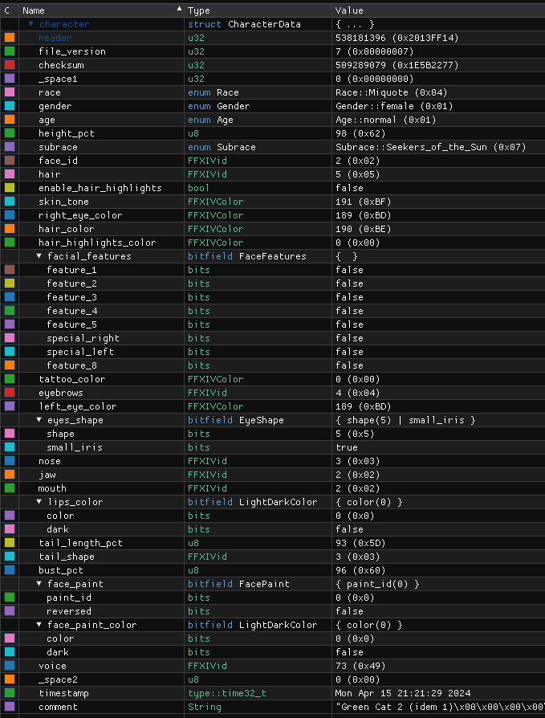

# Character Creator Preset file

The character creator saves it's presets in binairy files called `FFXIV_CHARA_XX.dat` where `XX` is the preset slot number. These files are located in the `<..>\Documents\My Games\FINAL FANTASY XIV - A Realm Reborn\` folder.

*Note: The investigation into this format has been made in a very cursory manner. There is no garantie of accuracy.*

## Binary format details
*[Last updated: FFXIV 7.0 Benchmark]*

The file is read in little endian format.

The file contains 4 sections:
- A 16 bytes header
- A 32 bytes data block
- A 40 bytes/characters comment section
- A 124 bytes of `0x00` at the end of the file

Here is a sample file, displayed in hexadecimal, from the 7.0 Benchmark Character Creator:

The colors represent the data sections related to this other view:

The mechanisms to understand this view are detailed in the next sections.

### File header

The 16 bytes of file header are split into 4 sections:
- A 32 bits file header `@0x00`, in orange. Always `0x2013FF14`.
- A 32 bits version ID `@0x04`. Only the LSB seems to be used. Here in green, `7`(`0x00000007`).
- A 32 bits assumed checksum value `@0x08`. Here in red, `0x77225B1E`.
- A 32 bits padding of `0x00000000` `@0x0C`, in purple.

### Data

The actual preset data follows. 
Using [ImHex](https://imhex.werwolv.net/)'s [pattern syntax](https://docs.werwolv.net/pattern-language), here is the actual character data, in order. The full pattern parser file for imHex is available [here](FFXIV_CHARA_XX_pattern.hexpat) and can be opened in any text editor or ImHex.

Knowing the following data sizes (See full pattern file for the full enum values):
```rust
Race = u8 enum;
Gender = u8 enum;
Age = u8 enum;
Subrace = u8 enum;
FFXIVid = u8;
FFXIVColor = u8;
FaceFeature = u8 bitfield;
EyeShape = u8;
LightDarkColor = u8;
FacePaint = u8;
```
*Notes:*
- *FaceFeature is a bitfield where each bit is considered a boolean for a specific feature. For exemple bits 6 (`0x40`) and 5 (`0x20`) represent left and right tattoos for Hyur and will be `1` when the tattos is visible.*
- *EyeShape, LightDarkColor and FacePaint use the 7th bit (MSB, `0x08`) of the `u8` as a boolean to for exemple, switch between "light" or "dark" color, or "reversed" facepaint.*

These are all of the data saved in the file:
```rust
    Race race;
    Gender gender;
    Age age;
    u8 height_pct;
    Subrace subrace;
    FFXIVid face_id;
    FFXIVid hair;
    match (race){
        (Race::Hrothgar): bool enable_fur_pattern;
        (_): bool enable_hair_highlights;
    }
    FFXIVColor skin_tone;
    FFXIVColor right_eye_color;
    FFXIVColor hair_color;
    match (race){
        (Race::Hrothgar): FFXIVColor pattern_fur_color;
        (_): FFXIVColor hair_highlights_color;
    }
    FaceFeatures facial_features;
    match (race){
        (Race::AuRa): FFXIVColor limbal_ring_color;
        (Subrace::Wildwood): FFXIVColor ear_clasp_color;
        (Subrace::Keepers_of_the_Moon & Gender::female): FFXIVColor ear_clasp_color;
        (_): FFXIVColor tattoo_color;
    }
    FFXIVid eyebrows;
    FFXIVColor left_eye_color;
    EyeShape eyes_shape;
    FFXIVid nose;
    FFXIVid jaw;
    FFXIVid mouth;
    match (race){
        (Race::Hrothgar): FFXIVid fur_pattern_id;
        (_): LightDarkColor lips_color;
    }
    match (race){
        (Race::Hyur | Race::Roegadyn): u8 muscle_tone_pct;
        (Race::Miquote | Race::AuRa | Race::Hrothgar): u8 tail_length_pct;
        (Race::Lalafell | Race::Elzen | Race::Viera): u8 ear_length_pct;
        (_): u8 _tbd;
    }
    FFXIVid tail_shape;
    u8 bust_pct;
    FacePaint face_paint;
    LightDarkColor face_paint_color;
    FFXIVid voice;
    u8 _space2;
```

*Sections containing `match (...){}` are single bytes that take on different meanings depending on, usually, the character's Race.*

### Comment
From `0x3000` to `0x5008` included are the 40 characters (bytes) available as a comment when saving the preset.

### Empty space
The rest of the file is empty space. No usage has been found *yet* for it.